# stream-bot

[](https://github.com/vonavikon/stream-bot)

Telegram-бот для захвата мыслей, ссылок и вопросов на ходу. Каждая запись сохраняется в markdown-файл и автоматически получает теги типа и домена через языковую модель. Замена «отправить себе в Избранное», но с последующей ручной проверкой.

## Что делает

Отправляешь боту что угодно: текст, ссылку, пересылку. Без команд и форматирования. Бот сохраняет запись с таймстемпом и в фоне классифицирует её — ставит тег типа (`task` / `idea` / `question` / `reference` / `trash`) и домена (`ai` / `career` / `dev` / `infra` / `product` / `pm` / `personal` / `naumen` / `learning`). Записи складываются в markdown-файл с разбивкой по датам, файл коммитится и пушится в git.

```
Telegram → appendEntry → stream.md
                        ↓
            classify (claude-haiku-4-5): type + domain
                        ↓
            tagEntry / strikethrough → updateCounters → git push
```



Смысл — разделить захват и обработку. На ходу сбрасываешь всё в одну точку, не думая о формате; за компьютером проходишь по записям руками и решаешь по каждой: сделать, превратить в заметку, отложить, удалить.

## Команды

| Команда | Действие |
|---------|----------|
| `/start` | приветствие |
| `/stream` | статистика: необработанные / идеи / вопросы / задачи |
| `/triage` | батч-обработка всех записей без тегов |
| (любой текст) | сохранить запись, реакция 👌, фоновый триаг, ответ с распознанным типом |

Бот отвечает только на `TELEGRAM_CHAT_ID` — это личный инструмент, не публичный.

## Стек

| Компонент | Технология | Зачем |
|-----------|-----------|-------|
| Бот | TypeScript + [grammY](https://grammy.dev/) | приём сообщений из Telegram |
| Классификация | Anthropic SDK, `claude-haiku-4-5` | тип и домен записи |
| Хранение | markdown-файл | читаемый формат, без vendor lock-in |
| Синк | git | версионность и синхронизация между устройствами |
| Деплой | Docker | работает 24/7 на VPS |

## Установка

Нужен Telegram-бот (токен у [@BotFather](https://t.me/BotFather)), ключ Anthropic API и git-репо заметок.

```bash
git clone https://github.com/vonavikon/stream-bot.git
cd stream-bot
cp .env.example .env
# заполнить .env
docker compose up -d --build
docker compose logs -f
```

### Структура notes/

Бот пишет в `<WIKI_PATH>/wiki/inbox/stream.md`. `WIKI_PATH` — корень git-репо заметок (там, где `.git`). В `docker-compose.yml` он монтируется в `/app/wiki`. Минимальная структура репо:

```
notes/                  ← корень репо, монтируется в /app/wiki
├── .git/
└── wiki/
    └── inbox/
        └── stream.md   ← стартовый файл со счётчиками
```

Стартовый `stream.md`:

```markdown
# Stream

_Необработанных: 0 · Задач: 0 · Идей: 0 · Вопросов: 0_

## Обработано
```

## Конфиг (.env)

| Переменная | Назначение |
|------------|------------|
| `TELEGRAM_BOT_TOKEN` | токен бота от BotFather |
| `TELEGRAM_CHAT_ID` | chat id — бот отвечает только этому чату |
| `ANTHROPIC_API_KEY` | ключ модели |
| `ANTHROPIC_BASE_URL` | Anthropic-совместимый endpoint (по умолчанию `https://api.anthropic.com`, подставляется любой шлюз) |
| `WIKI_PATH` | путь к репо заметок внутри контейнера (`/app/wiki`) |

## Git-синк

Контейнер работает как единственный писатель в репо заметок. Перед каждой записью — `git fetch` + `reset --hard origin/main` (сбрасывает локальное расхождение), затем `add -A` + `commit` + `push`. Жёстко, но детерминированно: бот всегда перекрывает ref и пушит своё. На других устройствах изменения появляются через обычный `git pull`. Ветка — `main`.

## Roadmap

Сейчас бот принимает только текст. Направления развития — через мультимодальный LLM-шлюз (STT, vision, embeddings под одним ключом), по убыванию отдачи:

1. **Конфигурируемый провайдер.** Модель захардкочена в `src/config.ts`, endpoint уже в env. Вынести модель в env и перевести классификатор на OpenAI-совместимый вызов — это открывает любой шлюз и снимает хардкод. База для остального.
2. **Голосовой ввод (STT).** `voice` → транскрипция → обычный путь классификации. Половина записей в проде — короткие наброски на ходу, голос лучше подходит под сценарий «руки заняты».
3. **Фото и скриншоты (vision).** `photo` → OCR + описание → запись. Сейчас фото молча пропускаются.
4. **Enrichment ссылок.** URL в записи → загрузка страницы → краткая выжимка → запись с контекстом. Закрывает «потом не помню, зачем сохранил».
5. **Дедупликация (embeddings).** При новой записи — embedding, поиск похожих в `stream.md` и архиве. Близкий дубль → пометка `trash` или ссылка.

## Лицензия

MIT — см. [LICENSE](LICENSE).